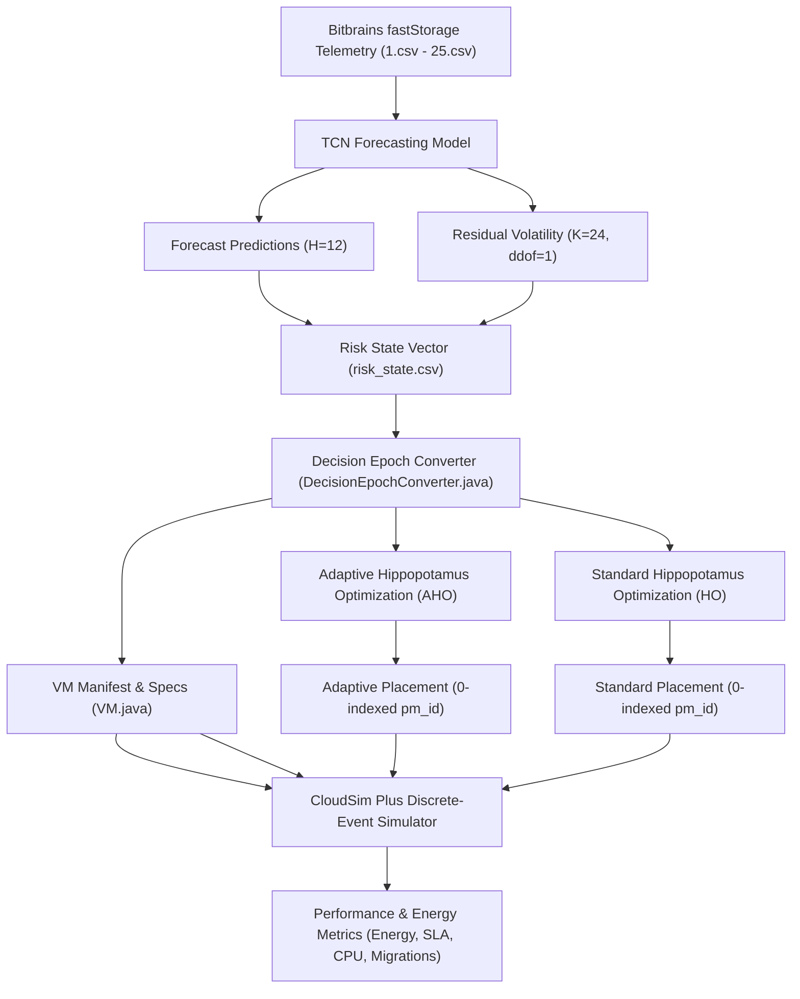

# Data and Model Provenance

This document establishes the scientific and engineering provenance for all parameters, datasets, models, simulations, and experimental assumptions utilized in the research project:
**"Predictive Energy-Efficient VM Placement in Cloud Using Machine Learning (TCN) and Adaptive Hippopotamus Optimization (AHO)"**.

Every parameter in this pipeline is strictly classified into one of four categories:
1. **Dataset-Derived** (Extracted directly from empirical telemetry traces)
2. **Model-Derived** (Learned or computed by the TCN forecasting and risk assessment stages)
3. **CloudSim Simulation Configuration** (Datacenter topology, hardware specifications, power profiles, and discrete-event simulation bounds)
4. **Experimental Assumption** (Defined experimental parameters, optimizer hyperparameters, and methodological decisions)

---

## 1. Provenance Classification Matrix

| Parameter / Component | Classification | Value / Definition | Source & Rationale |
| :--- | :--- | :--- | :--- |
| **Bitbrains Workload Traces** | **1. Dataset-Derived** | `fastStorage/2013-8` (`1.csv` ... `25.csv`) | Real-world telemetry from Bitbrains enterprise datacenter hosting business-critical VMs. Contains 5-minute sampling intervals of CPU usage MHz, CPU %, RAM KB, IOPS, and network bandwidth. |
| **Workload Sampling Period** | **1. Dataset-Derived** | $\Delta t = 300\text{ s}$ (5 minutes) | Native recording frequency of the Bitbrains monitoring infrastructure. |
| **Trace Timestamps** | **1. Dataset-Derived** | $1376314846 \dots 1378906798$ (Unix Epoch Seconds) | Recorded Unix epoch seconds spanning August to September 2013. |
| **Decision Epoch Timestamps** | **1. Dataset-Derived** | $1378604100 \dots 1378902900$ (997 decision points) | Evaluation split covering the final 997 consecutive 5-minute decision intervals in the dataset partition. |
| **TCN Architecture** | **2. Model-Derived** | Dilated Causal 1D Conv ($L=288$, Residual Blocks, Dropout=0.2) | Temporal Convolutional Network trained on historical sequence windows to capture both short-term oscillations and diurnal cycles. |
| **Forecast Lookback Window ($L$)** | **2. Model-Derived** | 288 steps (24 hours at 5-min intervals) | Sufficient historical context to capture daily recurring cyclical patterns. |
| **Forecast Horizon ($H$)** | **2. Model-Derived** | 12 steps (60 minutes forward) | Multi-step predictive window for lookahead capacity planning and proactive overload prevention. |
| **Residual Volatility ($K$)** | **2. Model-Derived** | Rolling window $K=24$ ($ddof=1$) | Causal sample standard deviation of one-step-ahead forecast residuals: $\sigma_t = \sqrt{\frac{1}{K-1} \sum_{i=0}^{K-1} (e_{t-i} - \bar{e})^2}$. Strictly excludes future information. |
| **Prediction Risk Score** | **2. Model-Derived** | Dynamic percentile metric $\in [0, 1]$ | Quantifies upper-tail forecast uncertainty and probability of VM demand exceeding predicted capacity. |
| **AHO Adaptive Signal** | **2. Model-Derived** | $S_t = 0.5 \cdot \text{Variation}_t + 0.5 \cdot \text{Risk}_t$ | Composite adaptive signal dynamically transitioning optimizer between Exploration (high risk) and Exploitation (low risk). |
| **AHO Exploration Probability** | **2. Model-Derived** | $p_{\text{explore}} = \text{clamp}(0.20 + 0.60 \cdot S_t, 0.20, 0.80)$ | Modulates Phase 1/Phase 2 search behavior dynamically based on predicted workload volatility. |
| **Datacenter PM Composition** | **3. CloudSim Config** | 20 PMs (10 $\times$ PM1, 6 $\times$ PM2, 4 $\times$ PM3) | Heterogeneous server pool modeling modern cloud datacenter infrastructure tiers. |
| **PM1 Hardware Specs** | **3. CloudSim Config** | 2 PEs @ 2660 MIPS, 4 GB RAM, 160 GB Disk | Small-tier server (Power: $P_{\text{static}}=93.7\text{ W}, P_{\text{max}}=135.0\text{ W}$). |
| **PM2 Hardware Specs** | **3. CloudSim Config** | 4 PEs @ 3067 MIPS, 8 GB RAM, 250 GB Disk | Medium-tier server (Power: $P_{\text{static}}=42.3\text{ W}, P_{\text{max}}=113.0\text{ W}$). |
| **PM3 Hardware Specs** | **3. CloudSim Config** | 12 PEs @ 3067 MIPS, 16 GB RAM, 500 GB Disk | Large-tier server (Power: $P_{\text{static}}=58.4\text{ W}, P_{\text{max}}=222.0\text{ W}$). |
| **PM Power Model** | **3. CloudSim Config** | Linear: $P(u) = P_{\text{static}} + (P_{\text{max}} - P_{\text{static}}) \cdot u$ | Standard SPECpower-derived linear energy consumption model in cloud literature. |
| **Datacenter Static Power State** | **3. CloudSim Config** | 20 PMs powered on | Datacenter-level baseline power tracking. Idle hosts consume static baseline $P_{\text{static}}$ while active hosts scale linearly with load. |
| **Observation Window** | **3. CloudSim Config** | $\Delta t_{\text{sim}} = 3600.0\text{ s}$ (1.0 hour) | CloudSim Plus simulation duration per decision epoch. |
| **Energy Calculation Interval** | **3. CloudSim Config** | $E\text{ (Wh)} = \sum_{h=0}^{19} P(u_h) \times \frac{3600\text{ s}}{3600\text{ s/h}} = \sum P(u_h) \times 1.0\text{ h}$ | Integrates instantaneous power draw over the 1-hour observation window. |
| **SLA Violation Definition** | **3. CloudSim Config** | $u_{\text{requested}} - u_{\text{delivered}} > 0.05$ (5% threshold) | Triggered when delivered CPU capacity falls below trace demand by $>5\%$ due to host resource contention. |
| **Inter-Epoch Migration Model** | **3. CloudSim Config** | $M_t = \sum_{v \in \mathcal{V}} \mathbb{I}(\text{host}_{t}(v) \neq \text{host}_{t-1}(v))$ | Tracks VM reallocations between consecutive decision epochs ($t-1 \to t$). Within static placement epochs, $M=0$. |
| **VM Sizing Tiers** | **4. Experimental Assumption** | 4 Tiers: Small, Medium, Large, XLarge | Defined in `VM.java` / `DecisionEpochConverter.java` as:  • Small: 1 PE, 500 MIPS, 512 MB RAM, 40 GB Disk • Medium: 2 PEs, 1000 MIPS, 1024 MB RAM, 60 GB Disk • Large: 3 PEs, 1500 MIPS, 2048 MB RAM, 80 GB Disk • XLarge: 4 PEs, 2000 MIPS, 3072 MB RAM, 100 GB Disk |
| **Random Seed Scheme** | **4. Experimental Assumption** | Deterministic: $\text{Base Seed} = 100000 + \text{epochIndex}$ | Standard HO uses $\text{Seed}+1$; Adaptive HO uses $\text{Seed}+2$. Both share an identical common initial population generated at $\text{Seed}$. |
| **Population Size ($N$)** | **4. Experimental Assumption** | 20 candidate solutions | Metaheuristic population size balancing exploration capability and runtime. |
| **Maximum Iterations ($I_{\text{max}}$)** | **4. Experimental Assumption** | 50 iterations | Convergence budget per decision epoch. |
| **Synthetic PABFD Baseline** | **4. Experimental Assumption** | 24 VMs placed across 11 PMs ($E = 1457.84\text{ Wh}$, SLA = 3) | Preserved historical multi-host synthetic benchmark for comparative reference. |

---

## 2. Pipeline Data Flow & Invariants

### Invariants:
1. **Single Source of Truth**: All VM specifications flow exclusively from `VM.java` $\to$ `DecisionEpochConverter.java` $\to$ `vm_manifest.csv` $\to$ `placement.csv` $\to$ CloudSim Plus `VmSimple`. No random, modular arithmetic (`rowIndex % 4`), or hardcoded arrays exist in CloudSim.
2. **Zero-Based Indexing**: Physical machine identifiers are strictly zero-based integers $\in [0, 19]$ matching `PM.java` and CloudSim `HostSimple` list indices.
3. **Deterministic Workload Replay**: `BitbrainsUtilizationModel` matches the exact Unix timestamp of each decision epoch, replaying real CPU usage percentages with no synthetic offsets.
4. **Independent Optimization**: Standard HO and Adaptive HO run independently with identical initial populations, differing only in AHO's real-time consumption of TCN prediction risk and volatility signals.
