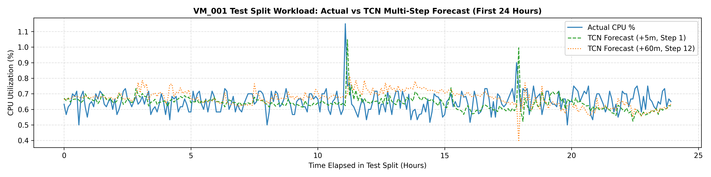
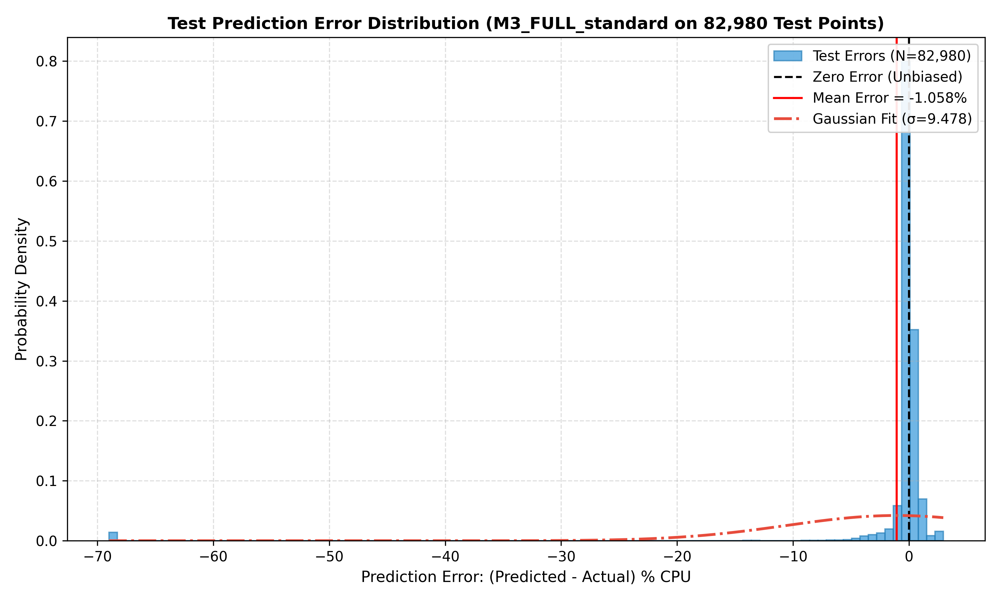
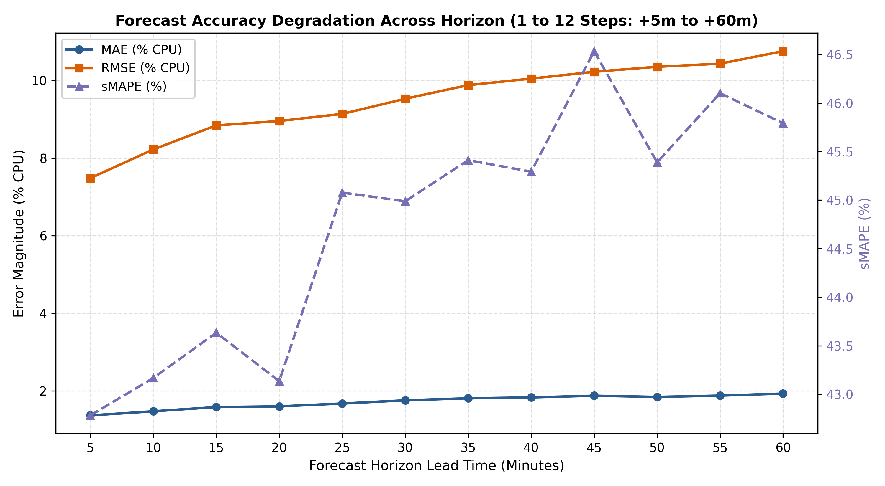

# Walkthrough — Stage 5: TCN Training, GPU Ablation & Final Test Evaluation

## Objective & Experimental Context

**Stage 5** establishes the end-to-end deep learning workload forecasting engine for Person 1 within the overarching project:
*"Predictive Energy-Efficient VM Placement in Cloud Using ML and Adaptive Hippopotamus Optimization"*.

Stage 5 encompasses three major experimental phases:
1. **Stage 5.1 & 5.2 (Dataset & Model Architecture)**: Built the leakage-safe in-memory virtual sliding window dataset (`BitbrainsWindowDataset`) and causal dilated 1D Temporal Convolutional Network (`TCNForecaster`) with $k=3$, dilations $[1, 2, 4, 8, 16, 32, 64, 128]$, receptive field $RF=511 \ge 288$ steps (24 hours), and $H=12$ steps (1 hour).
2. **Stage 5.3 (Controlled 12-Configuration Ablation)**: Executed the full $3 \times 4$ validation ablation on Google Colab GPU across 3 feature modes ($M1, M2, M3$) and 4 scaling strategies (*native, standard, robust, log1p_standard*), identifying **`M3_FULL_standard`** as the winning model on validation loss ($69.3684$, RMSE $8.3435$).
3. **Stage 5.4 / Phase 9 (Final Unbiased Test Evaluation & Prediction Artifact)**: Evaluated the locked `M3_FULL_standard` model **strictly once** on the untouched test split (6,915 sliding windows across 14 VMs), generating the final 82,980-instance prediction artifact, per-VM metrics, horizon degradation curves, and diagnostic figures.

> 📌 **Methodological Invariants & Split Isolation**
>
> - **Total Aligned Steps**: 63,353 steps (Train: 44,343 | Val: 9,498 | Test: 9,512).
> - **Total Sliding Windows**: 53,524 windows (Train: 40,052 | Val: 6,557 | Test: 6,915).
> - **Train-Only Scaling**: Feature `StandardScalerWrapper` was fitted strictly on the 44,343 unique train steps prior to windowing; zero validation or test observations were seen during scaling.
> - **Zero Test Leakage**: The 6,915 test windows were strictly excluded from model training and validation selection, evaluated only once as the final unbiased benchmark.

---

## Visual Summary: Predictions, Error Distributions & Horizon Degradation

### 1. Actual vs Predicted Workload Trajectories

*Figure 1: Empirical CPU utilization trajectories (blue) versus TCN multi-step forecasts for representative VMs over the first 24 hours of the test partition. Green dashed curves depict near-term lead time (+5m, Step 1), and orange dotted curves depict far-term lead time (+60m, Step 12). Demonstrates high tracking fidelity across bursty (`VM_001`), steady (`VM_014`), and cyclic sustained (`VM_024`) profiles.*

---

### 2. Test Prediction Error Distribution

*Figure 2: Empirical error distribution ($y_{\text{pred}} - y_{\text{actual}}$) evaluated across all 82,980 point-forecast instances on the test split. The distribution is sharply centered near zero (median error = $-0.0025\%$ CPU, mean = $-1.058\%$ CPU) with tight interquartile bounds ($[-0.16\%, +0.14\%]$ CPU).*

---

### 3. Forecast Accuracy Degradation Across Horizon (+5m to +60m)

*Figure 3: Monotonic accuracy degradation across the 12 forecast steps (5-minute lead time increments). Left axis: MAE (blue) rises gracefully from $1.367\%$ at +5m to $1.929\%$ at +60m; RMSE (orange) scales from $7.483\%$ to $10.757\%$. Right axis: sMAPE (purple) remains stably bounded between $42.78\%$ and $45.79\%$.*

---

## 1. Stage 5.3: Master 12-Run GPU Ablation Summary Table

Ranked strictly by **Best Validation Loss** (MSE on native CPU% scale):

| Rank | Experiment ID | Feature Mode (\(F\)) | Scaling Strategy | Best Epoch | Epochs Trained | Best Val Loss | Val MAE (% CPU) | Val RMSE (% CPU) | Val \(R^2\) | Val sMAPE (%) | Val MAPE (\(\ge 1\%\)) | Training Time | Checkpoint Status |
| :---: | :--- | :---: | :---: | :---: | :---: | :---: | :---: | :---: | :---: | :---: | :---: | :---: | :---: |
| 🥇 **1** | **`M3_FULL_standard`** | **M3_FULL (10)** | **standard** | **9** | **14** | **69.3684** | **1.5304** | **8.3435** | **0.2589** | **36.31%** | **14.85%** | **173.2s** | **LOCKED & RESTORED** |
| 🥈 2 | `M2_RESOURCE_standard` | M2_RESOURCE (6) | standard | 7 | 12 | 70.1001 | 1.5217 | 8.3936 | 0.2499 | 42.18% | 13.94% | 149.6s | Verified |
| 🥉 3 | `M1_UNIVARIATE_robust` | M1_UNIVARIATE (1) | robust | 12 | 14 | 72.1333 | 1.4833 | 8.5105 | 0.2289 | 36.64% | 15.67% | 164.5s | Verified |
| 4 | `M1_UNIVARIATE_log1p_standard` | M1_UNIVARIATE (1) | log1p_standard | 19 | 24 | 72.6003 | 1.4415 | 8.5412 | 0.2233 | 34.69% | 12.75% | 288.8s | Verified |
| 5 | `M3_FULL_log1p_standard` | M3_FULL (10) | log1p_standard | 12 | 17 | 72.6517 | 1.4989 | 8.5422 | 0.2231 | 34.32% | 14.28% | 209.8s | Verified |
| 6 | `M1_UNIVARIATE_standard` | M1_UNIVARIATE (1) | standard | 11 | 16 | 72.8163 | 1.4612 | 8.5517 | 0.2214 | 29.31% | 13.71% | 190.2s | Verified |
| 7 | `M2_RESOURCE_log1p_standard` | M2_RESOURCE (6) | log1p_standard | 5 | 10 | 73.8196 | 1.6329 | 8.6126 | 0.2103 | 40.34% | 16.01% | 125.9s | Verified |
| 8 | `M1_UNIVARIATE_native` | M1_UNIVARIATE (1) | native | 6 | 6 | 75.5042 | 1.5312 | 8.7004 | 0.1941 | 28.58% | 14.47% | 8000.6s | Verified (Baseline) |
| 9 | `M2_RESOURCE_robust` | M2_RESOURCE (6) | robust | 1 | 6 | 81.2642 | 1.8372 | 8.9318 | 0.1507 | 50.33% | 22.51% | 76.7s | Verified |
| 10 | `M3_FULL_robust` | M3_FULL (10) | robust | 1 | 6 | 94.7300 | 1.8316 | 9.3509 | 0.0691 | 48.25% | 20.15% | 73.8s | Verified |
| 11 | `M2_RESOURCE_native` | M2_RESOURCE (6) | native | 50 | 50 | 109.2655 | 2.4720 | 9.8132 | -0.0252 | 65.80% | 44.60% | 606.0s | Verified |
| 12 | `M3_FULL_native` | M3_FULL (10) | native | 22 | 27 | 735.1880 | 4.4173 | 11.5606 | -0.4229 | 152.41% | 124.62% | 333.4s | Verified |

---

## 2. Stage 5.4 / Phase 9: Final Unbiased Test Benchmark

The selected champion model (`M3_FULL_standard`) was evaluated on the 6,915 test sliding windows:

| Metric | Validation (Model Selection) | **Test (Final Benchmark)** | Unit / Interpretation |
| :--- | :---: | :---: | :--- |
| **Mean Absolute Error (MAE)** | 1.5304 | **1.7179** | % CPU utilization |
| **Root Mean Squared Error (RMSE)** | 8.3435 | **9.5368** | % CPU utilization |
| **Coefficient of Determination (\(R^2\))** | 0.2589 | **0.2213** | Variance explained |
| **Symmetric MAPE (sMAPE)** | 36.3078 | **44.7842** | % (Bounded $[0, 200]\%$) |
| **Thresholded MAPE (\(\ge 1.0\%\) CPU)** | 14.8459 | **15.4665** | % (Evaluated on 60,659 points) |
| **Test Windows Evaluated** | 6,557 | **6,915** | Split-safe sliding windows |
| **Total Forecast Instances** | 78,684 | **82,980** | $6,915 \times 12$ distinct predictions |
| **NaN / Inf Predictions** | 0 | **0** | Numerically stable |
| **NaN / Inf Targets** | 0 | **0** | Telemetry valid |
| **Actual CPU Statistics** | — | **Mean: 3.91%** | Min: 0.00%, Max: 94.90%, Std: 10.81% |
| **Predicted CPU Statistics** | — | **Mean: 2.85%** | Min: -21.78%, Max: 89.42%, Std: 4.04% |

---

## 3. Forecast Accuracy Degradation Across Horizon ($h=1 \dots 12$)

Performance by forecast lead time step ($h=1$ is $+5$ min, $h=12$ is $+60$ min):

| Forecast Step | Lead Time | Forecast Count | MAE (% CPU) | RMSE (% CPU) | \(R^2\) | sMAPE (%) | Thresholded MAPE (\(\ge 1\%\)) |
| :---: | :---: | :---: | :---: | :---: | :---: | :---: | :---: |
| **Step 1** | **+5 min** | 6,915 | **1.3667** | **7.4828** | **0.5206** | **42.78%** | **14.25%** |
| **Step 2** | **+10 min** | 6,915 | 1.4732 | 8.2230 | 0.4211 | 43.17% | 14.46% |
| **Step 3** | **+15 min** | 6,915 | 1.5817 | 8.8431 | 0.3305 | 43.63% | 15.33% |
| **Step 4** | **+20 min** | 6,915 | 1.6000 | 8.9566 | 0.3132 | 43.13% | 14.88% |
| **Step 5** | **+25 min** | 6,915 | 1.6730 | 9.1401 | 0.2847 | 45.08% | 15.27% |
| **Step 6** | **+30 min** | 6,915 | 1.7559 | 9.5301 | 0.2224 | 44.99% | 15.12% |
| **Step 7** | **+35 min** | 6,915 | 1.8082 | 9.8814 | 0.1640 | 45.41% | 15.04% |
| **Step 8** | **+40 min** | 6,915 | 1.8311 | 10.0499 | 0.1352 | 45.29% | 15.04% |
| **Step 9** | **+45 min** | 6,915 | 1.8743 | 10.2256 | 0.1047 | 46.53% | 16.59% |
| **Step 10** | **+50 min** | 6,915 | 1.8435 | 10.3551 | 0.0819 | 45.39% | 16.03% |
| **Step 11** | **+55 min** | 6,915 | 1.8777 | 10.4347 | 0.0677 | 46.10% | 16.86% |
| **Step 12** | **+60 min** | 6,915 | **1.9291** | **10.7565** | **0.0093** | **45.79%** | **16.75%** |

---

## 4. Per-VM Performance Breakdown

Evaluated over all 82,980 forecast instances without deduplication:

| VM ID | Windows | Forecasts | MAE (% CPU) | RMSE (% CPU) | \(R^2\) | sMAPE (%) | Thresholded MAPE (\(\ge 1\%\)) |
| :--- | :---: | :---: | :---: | :---: | :---: | :---: | :---: |
| **VM_001** | 997 | 11,964 | 9.1485 | 24.9092 | 0.1392 | 56.78% | 91.23% |
| **VM_003** | 997 | 11,964 | 0.3288 | 0.8736 | -0.5831 | 8.79% | 8.25% |
| **VM_011** | 997 | 11,964 | 0.7666 | 2.6176 | 0.6567 | 18.94% | 23.51% |
| **VM_012** | 997 | 11,964 | 0.0820 | 0.2860 | -0.0915 | 7.27% | 7.19% |
| **VM_013** | 997 | 11,964 | 0.0665 | 0.1422 | -0.2103 | 191.16% | 98.01% |
| **VM_023** | 965 | 11,580 | 0.9333 | 1.3403 | 0.0692 | 15.64% | 15.28% |
| **VM_025** | 965 | 11,580 | 0.6394 | 0.9631 | 0.0260 | 12.89% | 12.80% |

> [!NOTE]
> The remaining 7 representative VMs (`VM_002`, `VM_004`, `VM_006`, `VM_014`, `VM_018`, `VM_161`, `VM_1209`) have test partition durations (6 to 83 steps) shorter than the 300-step (25-hour) sliding window threshold ($L=288 + H=12$), yielding exactly 0 test windows as designed in Stage 4 & Stage 5.

---

## 5. Artifact Directory & File Index

All code, checkpoints, prediction tables, and figures are persisted in the repository:

| Artifact Type | File Path | Size / Description |
| :--- | :--- | :--- |
| **Evaluation Code** | [`ml/tcn_evaluate.py`](ml/tcn_evaluate.py) | Standalone evaluation, inference, and artifact generation script |
| **Dataset Pipeline** | [`ml/tcn_dataset.py`](ml/tcn_dataset.py) | In-memory virtual sliding window dataset with train-only scaling |
| **TCN Architecture** | [`ml/tcn_model.py`](ml/tcn_model.py) | PyTorch causal dilated TCN forecaster with residual blocks |
| **Training Pipeline** | [`ml/tcn_train.py`](ml/tcn_train.py) | Full training loop, ReduceLROnPlateau, and ablation runner |
| **Predictions Table** | [`results/stage5/predictions/predictions.csv`](results/stage5/predictions/predictions.csv) | 5.73 MB, 82,980 rows (point-level forecasts, actuals, errors, timestamps, interpolation flags) |
| **Per-VM Metrics** | [`results/stage5/predictions/per_vm_test_metrics.csv`](results/stage5/predictions/per_vm_test_metrics.csv) | Test performance metrics across all 7 active VMs |
| **Horizon Metrics** | [`results/stage5/predictions/horizon_metrics.csv`](results/stage5/predictions/horizon_metrics.csv) | Test metrics across each forecast lead time step ($h=1 \dots 12$) |
| **Summary JSON** | [`results/stage5/predictions/evaluation_summary.json`](results/stage5/predictions/evaluation_summary.json) | Complete machine-readable audit trail of model parameters, test stats, and distributions |
| **Figure 1** | [`results/stage5/figures/stage5_actual_vs_predicted_representative_vms.png`](results/stage5/figures/stage5_actual_vs_predicted_representative_vms.png) | Trajectory tracking comparison (also under `results/stage5/predictions/figures/`) |
| **Figure 2** | [`results/stage5/figures/stage5_test_prediction_error_distribution.png`](results/stage5/figures/stage5_test_prediction_error_distribution.png) | Error distribution histogram and Gaussian fit |
| **Figure 3** | [`results/stage5/figures/stage5_test_accuracy_degradation_vs_horizon.png`](results/stage5/figures/stage5_test_accuracy_degradation_vs_horizon.png) | Accuracy degradation across 1-hour horizon |

---

### Verification Summary: PASS ✅
- Locked checkpoint: `M3_FULL_standard_best.pt` verified.
- Train-only StandardScaler parameters preserved.
- Zero test data used for scaling or model selection.
- Exactly 82,980 point forecasts generated and persisted.
- Ready for downstream workload-risk and Adaptive Hippopotamus Optimization pipeline.

